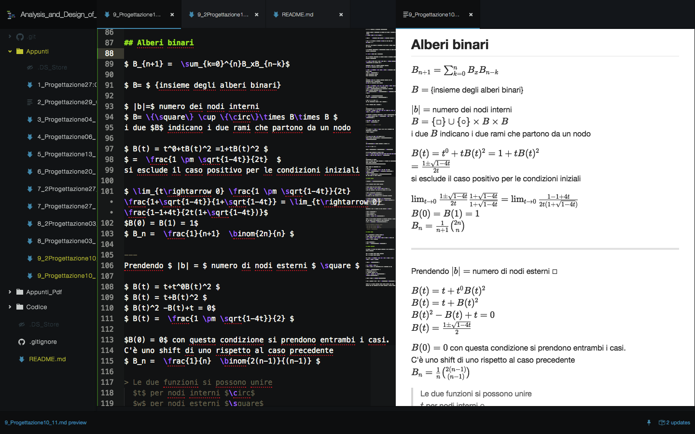

# Progettazione e analisi di algoritmi

Appunti del corso di PAA 16/17

## Creare i Pdf
Usando [Atom](https://atom.io) insieme al plug-in [markdown-preview-enhanced](https://atom.io/packages/markdown-preview-enhanced) si possono esportare i pdf dai file markdown. Il plugin usa [Mathjax](https://www.mathjax.org) per renderizzare le parti scritte in latex.

